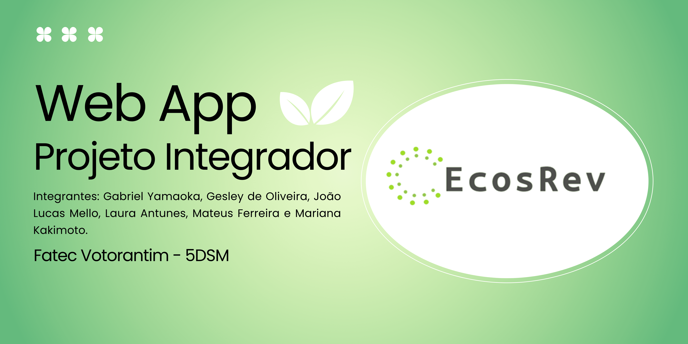

# 

---
# 📱 Ecosrev — Seu app para descarte consciente de resíduos eletrônicos
---
## Índice
- [Sobre o Projeto](#-ecosrev--seu-app-para-descarte-consciente-de-resíduos-eletrônicos)
- [Tecnologias Frontend](#-tecnologias-frontend)
- [Tecnologias Backend](#-tecnologias-backend)
- [Requisitos Funcionais](#-requisitos)
- [Requisitos Não Funcionais](#-requisitos)
- [Protótipo](#-protótipo)
- [Equipe](#-desenvolvedores)
---
## Sobre o Projeto

**Ecosrev** é um aplicativo mobile criado para facilitar e incentivar o descarte correto de resíduos eletroeletrônicos. A plataforma conecta usuários a pontos de coleta e empresas especializadas, tornando o processo de reciclagem mais prático, acessível e sustentável.

Por meio do app, qualquer pessoa pode localizar locais de coleta, agendar descartes e acompanhar sua contribuição para o meio ambiente. Além disso, o Ecosrev oferece recompensas para os usuários que praticam o descarte responsável, estimulando hábitos sustentáveis no dia a dia.

O aplicativo foi desenvolvido como parte do projeto da disciplina de Laboratório de Desenvolvimento Mobile, utilizando tecnologias modernas que garantem uma experiência intuitiva, fluida e eficiente, tanto para os usuários quanto para os parceiros da plataforma.

---

## 🧩 Tecnologias Frontend

### 📱 Framework e Ambiente
 
 

### 🎨 Estilização e UI
 
 
 
 

### 🔧 Navegação
 
 
 

### 🗂️ Gerenciamento de Dados e Configurações
 

### 🧠 Formulários e Validação
 

### 📸 Funcionalidades Extras
 
 
 

### 🔗 Comunicação com API

### 🏗️ Desenvolvimento e Scripts
 

## 🚀 Tecnologias Backend

### 🔧 Framework e Server

### 🔒 Autenticação e Segurança
 
 

### 🗄️ Banco de Dados
 

### 📆 Datas e Timezones
 

### 💌 Email

### 🧹 Validação

### 📜 Documentação
 
 

### 🔐 Variáveis de Ambiente

### 🧪 Testes
 

### 🚀 Desenvolvimento

 
---

## 📜 Requisitos

  
Requisitos Funcionais (RF)

  <!-- RF01 - Gerenciamento de Usuários -->
  

    
RF01 - Gerenciamento de Usuários

    
O sistema deve permitir o cadastro de novos usuários com nome, email, senha e telefone.

    
O sistema deve validar a unicidade do email no cadastro.

    
O sistema deve permitir login com email e senha.

    
O sistema deve manter sessão do usuário logado.

    
O sistema deve permitir logout do usuário.

  

  <!-- RF02 - Recuperação de Senha -->
  

    
RF02 - Recuperação de Senha

    
O sistema deve permitir solicitar recuperação de senha via email.

    
O sistema deve enviar link/código de recuperação por email.

    
O sistema deve permitir redefinir senha através do link/código válido.

    
O sistema deve invalidar links de recuperação após uso ou expiração.

  

  <!-- RF03 - Alteração de Senha -->
  

    
RF03 - Alteração de Senha

    
O sistema deve permitir alterar senha informando a senha atual.

    
O sistema deve validar a senha atual antes de permitir alteração.

    
O sistema deve confirmar nova senha antes da alteração.

  

  <!-- RF04 - Sistema de Pontos via QR Code -->
  

    
RF04 - Sistema de Pontos via QR Code

    
O sistema deve permitir leitura de QR codes através da câmera.

    
O sistema deve validar e processar QR codes válidos.

    
O sistema deve adicionar pontos à conta do usuário após leitura válida.

    
O sistema deve impedir uso múltiplo do mesmo QR code pelo mesmo usuário.

    
O sistema deve exibir confirmação de pontos recebidos.

  

  <!-- RF05 - Resgate de Benefícios -->
  

    
RF05 - Resgate de Benefícios

    
O sistema deve listar benefícios disponíveis (ingressos, descontos).

    
O sistema deve exibir custo em pontos de cada benefício.

    
O sistema deve verificar saldo suficiente antes do resgate.

    
O sistema deve processar resgate e debitar pontos da conta.

    
O sistema deve gerar comprovante/código do benefício resgatado.

    
O sistema deve impedir resgate com saldo insuficiente.

  

  <!-- RF06 - Histórico e Saldo -->
  

    
RF06 - Histórico e Saldo

    
O sistema deve exibir saldo atual de pontos do usuário.

    
O sistema deve listar histórico de ganho de pontos.

    
O sistema deve listar histórico de gastos/resgates.

    
O sistema deve permitir filtrar histórico por período.

    
O sistema deve exibir detalhes de cada transação.

  

  <!-- RF07 - Perfil do Usuário -->
  

    
RF07 - Perfil do Usuário

    
O sistema deve permitir visualizar dados do perfil.

    
O sistema deve permitir editar dados básicos do perfil.

    
O sistema deve validar alterações antes de salvar.

  

    <!-- RF08 - Acessibilidade -->
  

    
RF08 - Acessibilidade

    
O sistema deve permitir ao usuário ajustar o tamanho das fontes para melhorar a legibilidade.

    
O sistema deve garantir que as alterações de tamanho de fonte sejam aplicadas em todas as telas e componentes do aplicativo.

    
O sistema deve manter a usabilidade e layout adequados mesmo com tamanhos de fonte maiores.

  

  
Requisitos Não Funcionais (RNF)

  <!-- RNF01 - Performance -->
  

    
RNF01 - Performance

    
O tempo de resposta da API não deve exceder 5 segundos.

    
O tempo de login não deve exceder 3 segundos.

    
A leitura de QR code deve ser processada em até 1 segundo.

    
O carregamento da tela inicial deve ocorrer em até 2 segundos.

  

  <!-- RNF02 - Usabilidade -->
  

    
RNF02 - Usabilidade

    
A interface deve ser intuitiva e seguir padrões mobile.

    
O aplicativo deve funcionar em modo portrait e landscape.

    
Fontes e botões devem ter tamanho adequado para toque.

    
Feedback visual deve ser fornecido para todas as ações do usuário.

  

  <!-- RNF03 - Compatibilidade -->
  

    
RNF03 - Compatibilidade

    
O app deve ser compatível com Android 7.0+ e iOS 12.0+.

    
O backend deve ser compatível com Node.js 20+.

  

  <!-- RNF04 - Segurança -->
  

    
RNF04 - Segurança

    
Senhas devem ser armazenadas com hash seguro (bcrypt).

    
Comunicação deve usar HTTPS/TLS.

    
Tokens de autenticação devem ter expiração.

    
QR codes devem ter validação contra reutilização.

    
Dados sensíveis não devem ser logados.

  

  <!-- RNF05 - Disponibilidade -->
  

    
RNF05 - Disponibilidade

    
Sincronização automática quando conexão for restabelecida.

  

  <!-- RNF06 - Escalabilidade -->
  

    
RNF06 - Escalabilidade

    
O sistema deve suportar até 1000 usuários simultâneos.

    
O banco de dados deve suportar crescimento de 10000 transações/mês.

    
A arquitetura deve permitir expansão horizontal.

  

  <!-- RNF07 - Manutenibilidade -->
  

    
RNF07 - Manutenibilidade

    
Código deve seguir padrões de Clean Code.

    
APIs devem ser documentadas (Swagger).

    
Logs estruturados devem ser implementados.

    
Versionamento semântico deve ser adotado.

  

  <!-- RNF08 - Privacidade -->
  

    
RNF08 - Privacidade

    
Sistema deve estar em conformidade com LGPD.

    
Usuário deve poder solicitar exclusão de dados.

    
Dados pessoais devem ser minimizados e protegidos.

  

  <!-- RNF09 - Recursos do Dispositivo -->
  

    
RNF09 - Recursos do Dispositivo

    
App deve solicitar permissão para uso da câmera.

    
App deve funcionar com pelo menos 2GB de RAM.

    
App deve ocupar no máximo 200MB de armazenamento.

    
Consumo de bateria deve ser otimizado.

  

---

## 💡 Protótipo

Acesse o protótipo no Figma:  

[Acesse aqui o protótipo!](https://www.figma.com/design/bXL4WXW3bh4LPZq1Nl6Mbh/EcosRev---com-tratamento-de-exce%C3%A7%C3%A3o?node-id=0-1&t=NFlEy2NGOc1szUI9-1)

---

## 🧑‍💻 Desenvolvedores

Este projeto foi desenvolvido por uma equipe de estudantes do curso de Desenvolvimento de Software Multiplataforma. Abaixo estão os nomes dos colaboradores:

| Nome | GitHub | Função |
| ---- | ------ | -------------- |
| *Gabriel Yamaoka Bernardes* | [YamaokaK](https://github.com/YamaokaK) | DevOps |
| *João Lucas Melo* | [JoaoLucasMdO](https://github.com/JoaoLucasMdO) | Mobile Developer |
| *Laura Jane Antunes* | [LauraJaneAntunes](https://github.com/LauraJaneAntunes) | Frontend Developer |
| *Mariana Hirata* | [marianakakimoto](https://github.com/marianakakimoto) | Product Owner (PO) |
| *Mateus Ferreira* | [AEntropia](https://github.com/AEntropia) | Backend Developer |
| *Gesley de Oliveira* | [GesleyOliveira](https://github.com/GesleyOliveira)  | Quality Assurance |

